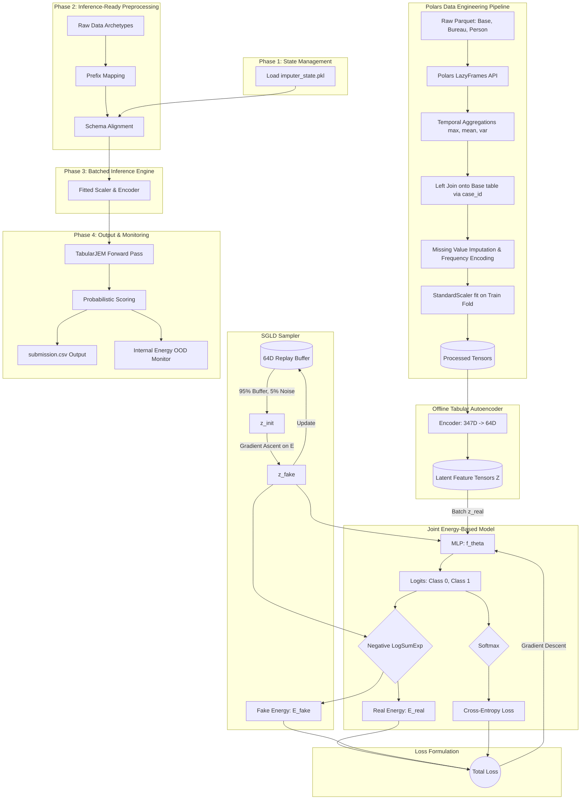

## Architectural Data Flow

## Inference Phase Orchestration

The JEM Inference Pipeline is executed through four distinct phases:

1.  **Phase 1: State Management**: The pipeline initializes the environment by loading precomputed transformation statistics (medians, frequency maps, training schema) from the `artifact_dir`.
2.  **Phase 2: Inference-Ready Preprocessing**: The `src.data.pipeline` executes in `is_inference=True` mode, performing automatic table prefix mapping and ensuring strict schema alignment with the training set.
3.  **Phase 3: Batched Inference Engine**: To maintain a constant memory profile ($O(batch\_size)$), the inference engine uses a PyTorch `DataLoader` to stream features through the `TorchStandardScaler`, `TabularAutoencoder`, and `TabularJEM`.
4.  **Phase 4: Output & Monitoring**: The final stage aggregates probabilistic scores, generates the competition-compliant `submission.csv`, and reports diagnostic **Energy** ($E(x)$) statistics to monitor for temporal distribution shifts.
