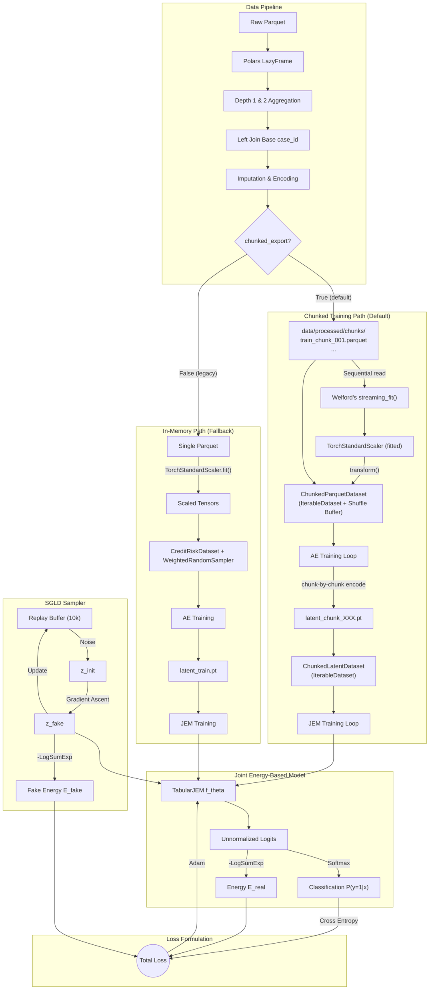

# System Architecture & Data Flow

## 0. Pipeline Deep-Dive Documentation
For detailed, step-by-step documentation on each pipeline stage, please refer to the following granular technical specifications:

1. [Data Processing Pipeline](../pipeline/01_data_processing.md) - Deep dive into Polars lazy execution, hybrid chunking, and multi-depth aggregations.
2. [Autoencoder Training](../pipeline/02_autoencoder_training.md) - Out-of-core scaling, chunked latent dataset generation, and continuous mappings.
3. [JEM Training](../pipeline/03_jem_training.md) - SGLD replay buffering, contrastive divergence logic, and dual generative/discriminative objectives.
4. [Inference Engine](../pipeline/04_inference.md) - Strict stateless operations, mapping fixed parameters out-of-fold.

## 1. Core Components

### 1.1 Data Engineering Pipeline (Polars)
* **Goal**: Process and aggregate multi-depth relational tables into a single tabular feature matrix.
* **Mechanism**: Lazy evaluation engine leveraging predicate pushdown.
* **Steps**:
  1. Load Base table and apply stratified sampling (if training).
  2. Perform temporal aggregations (mean, max, var) on Depth 1 & 2 relational tables.
  3. Join aggregated tables onto the Base table grain (`case_id`).
  4. Handle missing values and apply Frequency Encoding tracking state via `imputer_state.pkl`.
  5. Export: **Chunked Parquet** (default, `chunked_export=True`) writes numbered partitions to `data/processed/chunks/` with configurable `chunk_size` (default: 200k rows). Falls back to single-file export when disabled.

### 1.2 Dimensionality Reduction (Autoencoder)
* **Goal**: Overcome sparsity and strict discrete constraints of tabular datasets.
* **Mechanism**: Maps input dimensional space $D$ to a continuous latent vector $Z \in \mathbb{R}^{64}$.
* **Usage**: Provides a strict, dense, and continuous manifold for the SGLD sampler to operate stably.

### 1.3 Joint Energy-Based Model (TabularJEM)
* **Goal**: Simultaneous discriminative classification $P(y|x)$ and generative modeling $P(x)$.
* **Mechanism**: Multi-layer perceptron (Default `[256, 256]`) employing Spectral Normalization to enforce Lipschitz constraints.
* **Outputs**: Unnormalized logits mapping to Normalizing Flows (Softmax) and Energy landscapes (LogSumExp).

### 1.4 Generation Engine (SGLD & Replay Buffer)
> [!NOTE]
> The SGLD Replay Buffer (fixed 10k samples) is fully compatible with chunked streaming — it receives detached mini-batches and requires no API changes.
* **Goal**: Provide contrastive negative samples for EBM training.
* **Mechanism**:
  1. Seeding from a Replay Buffer or random noise (bound by `reinit_freq=0.05`).
  2. Following energy gradients via Langevin Dynamics to find $Z_{fake}$.

---

### 1.5 Chunked Training Pipeline
* **Goal**: Keep peak memory bounded to `O(chunk_size × num_features)` regardless of total dataset size.
* **Components**:
  - **`export_to_chunked_parquet()`** — Writes numbered `.parquet` partitions (≤200k rows each).
  - **`TorchStandardScaler.streaming_fit()`** — Welford's online algorithm (FP64 accumulators) computes global mean/variance in a single pre-pass.
  - **`ChunkedParquetDataset`** (`IterableDataset`) — Reads one chunk at a time, applies scaler, fills a shuffle buffer (default 50k rows), yields `(x, y, week, sample_weight)`.
  - **`ChunkedLatentDataset`** (`IterableDataset`) — Same streaming semantics over `.pt` latent chunk files.
  - **Chunk-level class weighting** — `1/class_count[y]` computed per-chunk, replacing global `WeightedRandomSampler`.
* **Epoch Semantics**: 1 epoch = 1 full pass over ALL chunks. Chunk order reshuffled per epoch via `set_epoch()`.
* **Constraints**: `num_workers=0` (no multi-worker support yet). Validation remains in-memory.

---

## 2. High-Level Data Flow Diagram

---

## 3. Inference Orchestration

> [!NOTE]
> The inference pipeline is **unaffected** by the chunked training changes. It already processes data in constant-memory batches via `DataLoader` and does not depend on the training export format.

The pipeline runs inference via `scripts/generate_submission.py` in 4 explicit phases:

1. **Phase 1: Data Pipeline (INFERENCE mode)**
   * `is_inference=True`, `sample_ratio=1.0`.
   * Uses prefix-mapping replacing `train_` with `test_`.
   * Restores `imputer_state.pkl` without updating it.
2. **Phase 2: Load Pre-Trained Models**
   * Imports `TorchStandardScaler`, `TabularAutoencoder`, and `TabularJEM`.
   * Validates target feature dimensionality against the scaled columns.
3. **Phase 3: Batched Inference Engine**
   * Employs PyTorch `DataLoader` to map chunks into $O(batch\_size)$ constant memory.
   * Derives `P(y=1|x)` through Softmax and gathers Energy $E(x)$.
4. **Phase 4: Output & Monitoring**
   * Exports `submission.csv` containing `case_id` and normalized `score`.
   * Evaluates $E_{test}$ mean and variance to detect out-of-distribution (OOD) sets.
