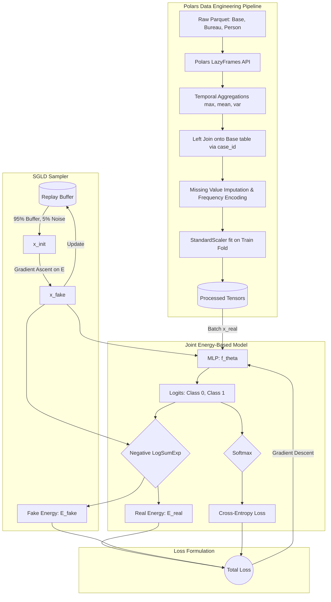

## Architectural Data Flow

```mermaid
graph TD
    subgraph Polars Data Engineering Pipeline
        A[Raw Parquet: Base, Bureau, Person] --> B[Polars LazyFrames API]
        B --> C[Temporal Aggregations max, mean, var]
        C --> D[Left Join onto Base table via case_id]
        D --> D1[Missing Value Imputation & Frequency Encoding]
        D1 --> E[StandardScaler fit on Train Fold]
        E --> F[(Processed Tensors)]
    end

    subgraph Joint Energy-Based Model
        F -->|Batch x_real| G[MLP: f_theta]
        G --> H[Logits: Class 0, Class 1]

        H --> I{Softmax}
        I --> J[Cross-Entropy Loss]

        H --> K{Negative LogSumExp}
        K --> L[Real Energy: E_real]
    end

    subgraph SGLD Sampler
        M[(Replay Buffer)] -->|95% Buffer, 5% Noise| N[x_init]
        N -->|Gradient Ascent on E| O[x_fake]
        O --> G
        O -->|Update| M
        O --> K
        K --> P[Fake Energy: E_fake]
    end

    subgraph Loss Formulation
        L --> Q((Total Loss))
        P --> Q
        J --> Q
        Q -->|Gradient Descent| G
    end
```
