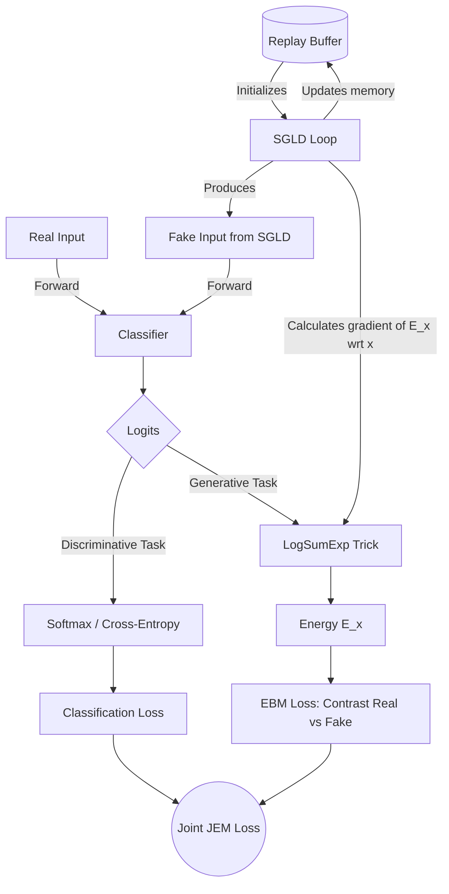

# Fundamentals of EBM and JEM

## 1. Energy-Based Models (EBM)
EBMs define the probability density of data through the Boltzmann distribution:
$$p_\theta(x) = \frac{\exp(-E_\theta(x))}{Z(\theta)}$$
*   **$E_\theta(x)$**: Energy function (parameterized by a neural network). The goal is to assign low energy values to real data and high energy values to out-of-distribution (fake) data.
*   **$Z(\theta)$**: Partition function. It is an intractable spatial integral that prevents the exact calculation of the likelihood.
*   **Training Logic**: Since $Z(\theta)$ is intractable, a contrastive approach is used: the energy of real data is "pushed down" while the energy of fake data sampled from the model is "pulled up".

## 2. Joint Energy-based Models (JEM)
JEM is a technique that reinterprets a standard discriminative classifier as an EBM on the joint distribution $p(x, y)$.
*   **The Link (LogSumExp Trick)**: Instead of creating a separate network for the energy, the output logits from the classifier $f_\theta(x)$ are reused. The energy of an input $x$ is obtained by marginalizing over all classes $y$:
    $$E_\theta(x) = -\log \sum_y \exp(f_\theta(x)[y])$$
*   **Dual Loss**: The model is optimized simultaneously for standard classification $p(y|x)$ (via Cross-Entropy) and generative modeling $p(x)$ (by lowering the energy of real data compared to fake data).

## 3. SGLD and Replay Buffer (The Generation Engine)
To train the EBM component of JEM, generating fake samples ($x_{fake}$) is crucial.
*   **SGLD (Stochastic Gradient Langevin Dynamics)**: This is the sampling algorithm. It iteratively updates the input values by moving them along the descending gradient of the energy (towards high-probability zones) and injecting Gaussian noise to avoid collapsing into local minima.
*   **Replay Buffer**: Since SGLD requires too many steps to converge if started from pure random noise, a memory buffer is used. By sampling generated inputs from previous training steps and using them as starting points for new SGLD chains, the model converges much faster and remains stable.

---

## Component Relationships (Diagram)

