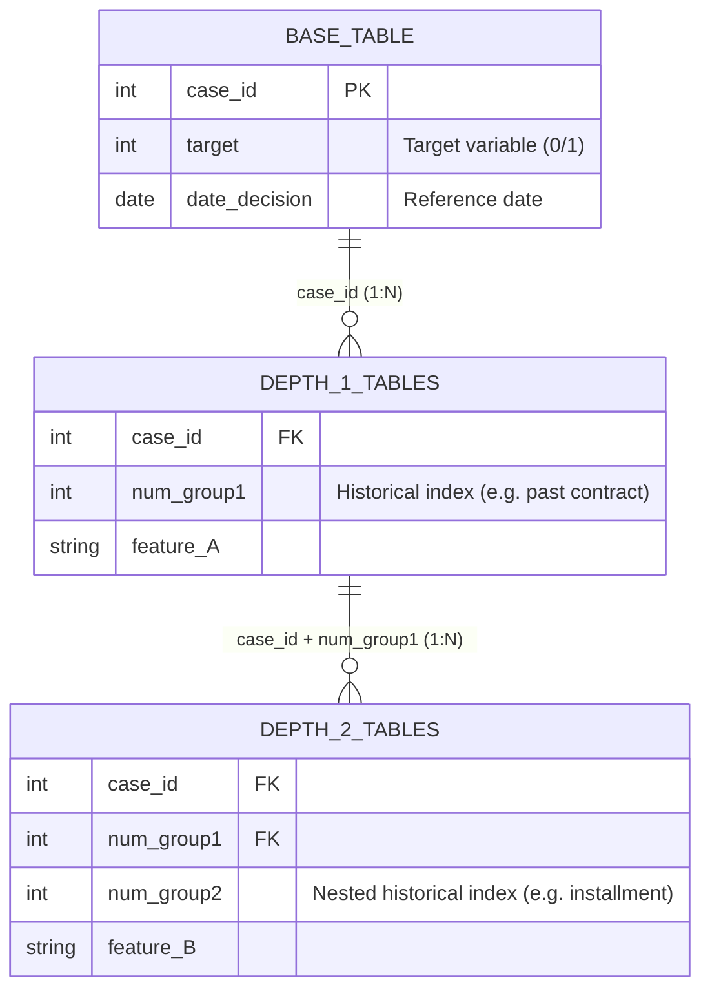

# Home Credit - Credit Risk Model Stability: Data Dictionary

## 1. Overview and Core Concepts

The goal of this project is to predict client loan defaults (`target`) while ensuring the model maintains **feature stability over time**. 

### Data Nature: Time-Series vs. Static
While the primary objective is a binary classification, the underlying data is essentially **longitudinal**. It consists of:
*   **Static Snapshots**: Current attributes of the applicant at the time of decision.
*   **Historical Records**: Time-distributed events (past applications, credit bureau history, tax records). 

Although not a traditional "forecasting" problem, the historical records represent **temporal sequences** that can be aggregated or processed using temporal models (like GNNs or RNNs) to capture behaviors.

## 2. Table Relationships and Depth System

The dataset is structured hierarchically using a "depth" system to manage different levels of historical detail.

### Join Logic
The primary key for all tables is `case_id`. Historical tables use auxiliary keys `num_group1` and `num_group2` for indexing.



### Depth Definitions
*   **Depth 0**: Static features. One record per `case_id`. (e.g., `static_0_x`, `static_cb_0`)
*   **Depth 1**: Multiple records per `case_id`, indexed by `num_group1`. (e.g., `applprev_1_x`, `person_1`)
*   **Depth 2**: Nested records. Multiple records per `(case_id, num_group1)`, indexed by `num_group2`. (e.g., `applprev_2`, `person_2`)


## 3. Feature Naming Conventions

All features in the dataset follow a strictly defined naming convention where the last letter of the feature name indicates the data type or transformation group.

| Suffix | Type | Description |
| :--- | :--- | :--- |
| **P** | Transform | Post-processed numerical features (e.g., DPD, averages). |
| **A** | Amount | Monetary amounts (e.g., debt, annuity, limit). |
| **D** | Date | Calendar dates. |
| **M** | Masked | Categorical features (masked or hashed strings). |
| **T** | Time | Temporal features related to periods (months, years, ordinals). |
| **L** | Logical | Categorical/Boolean features (e.g., education level, role). |

**Example**: `actualdpd_943P` is a processed Numerical field, while `amount_1115A` is an Amount.

## 4. Understanding Table Chunks (Physical vs Logical)

To handle memory constraints and large volumes, data is provided in partitioned files (chunks).

### File Structure
The physical files follow the template: `{mode}_{table_name}_{subset}_{chunk_id}.{ext}`
*   **Logical Table**: `static_0`
*   **Physical Files**: `train_static_0_0.parquet`, `train_static_0_1.parquet`, etc.

### Implementation Note
For data engineering pipelines, physical chunks belonging to the same logical table (same depth and prefix) should be **concatenated** before performing joins on `case_id`.

```python
# Conceptual Logical Loading
df_static = pd.concat([
    pd.read_parquet("train_static_0_0.parquet"),
    pd.read_parquet("train_static_0_1.parquet")
])
```


## 5. Table Catalog

The logical tables are separated by their data source and update frequency.

### Internal Data (Home Credit)
*   **`base`**: The fundamental table. Contains the `case_id`, `date_decision`, and the `target` (0 for non-default, 1 for default). 
*   **`static_0`** & **`static_cb_0`**: (Depth 0) Static applicant properties at the time of application.
*   **`applprev_1`**: (Depth 1) Historical internal applications associated with the client.
*   **`applprev_2`**: (Depth 2) Nested historical details for the applications in `applprev_1`.
*   **`person_1`** & **`person_2`**: Personal details and contact information of the applicant and related persons.

### External Data (Credit Bureau & Government)
*   **`credit_bureau_a_1`** & **`credit_bureau_a_2`**: Credit history details sourced from external credit bureau A.
*   **`credit_bureau_b_1`** & **`credit_bureau_b_2`**: Credit history details sourced from external credit bureau B.
*   **`tax_registry_a_1`**, **`tax_registry_b_1`**, **`tax_registry_c_1`**: Data sourced from different government tax authority providers.

### Other Specific Tables
*   **`debitcard_1`**, **`deposit_1`**, **`other_1`**: Specific product or account history information.
