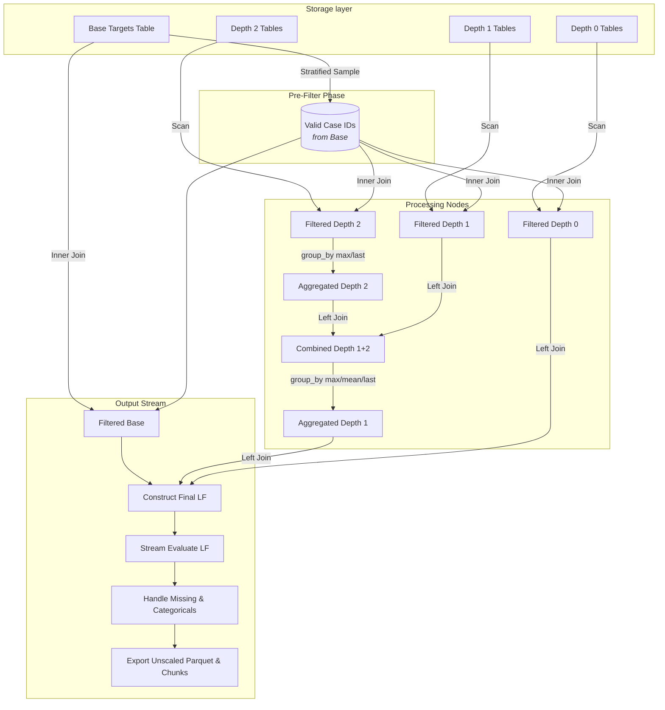

# Data Processing Pipeline

## Overview
The Data Processing Pipeline (`src/data/pipeline.py`) is responsible for taking raw multi-depth Home Credit parquet files and producing flattened, engineered, and imputed feature matrices for both training and inference. It heavily utilizes **Polars** for lazy execution and streaming capable data joins.

## Core Modules References
* `src/data/pipeline.py`: Main orchestrator `run_pipeline()`. Sets up the End-to-End lazy execution graph.
* `src/data/loader.py`: Exposes `scan_table()` which dynamically globs parquet chunks and natively normalizes schema drifts across chunks.
* `src/data/aggregators.py`: Implements logic for flattening `depth_2` (granular data) and `depth_1` datasets up to a common `depth_0` / `base` grain using group-by mechanisms.
* `src/data/imputation.py`: Handles stateful null-filling and categorical encoding.

## Pipeline Architecture

The pipeline processes massive nested datasets by defining a deep lazy-computation tree, reducing data volume iteratively via inner-joins *before* aggregations, and left-joining the finalized features to a central base.

## Execution Modes
* **Training Mode:** Applies `.sample()` to generate random stratified training chunks, computes new statistics parameters for missing data/categoricals, and saves an `imputer_state.pkl`. Allows chunked `.parquet` exports.
* **Inference Mode:** Skips stratified sampling (processes 100% of prediction batch), automatically replaces `train_` file prefixes to `test_`, loads `imputer_state.pkl` statically to prevent leakage, and exports a single feature test set.

## Chunk Concatenation
When scanning `loader.py`, dataset chunks (e.g. `train_person_1_0`, `train_person_1_1`) are identified via Glob patterns. To prevent crashes due to "Null" chunks schema drift, it actively reads `schema.items()` and casts pure Nulls to competition standard types (`String` for `_D` date suffixes, `Float64` for `_A` amount features) before `pl.concat(..., how="vertical_relaxed")`.
