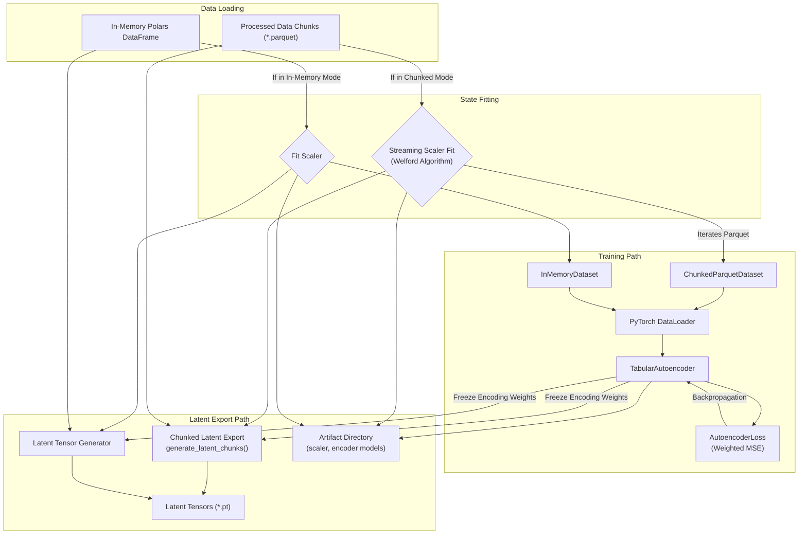
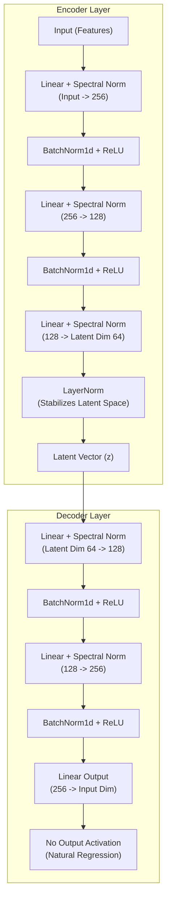

# Autoencoder Pre-training & Latent Generation

## Overview
The Autoencoder pipeline (`src/model/autoencoder/train_autoencoder.py`) is responsible for reducing the high-dimensional, highly sparse feature matrix into a dense latent representation (`z`) to be consumed by the Joint Energy Model (JEM). It achieves this by training a `TabularAutoencoder` using PyTorch.

## Core Modules References
* `src/model/autoencoder/train_autoencoder.py`: The entry point for the Autoencoder training pipeline. Provides two execution paths (`_train_chunked` for out-of-core and `_train_in_memory` for small datasets).
* `src/model/autoencoder/model.py`: Contains the `TabularAutoencoder` architecture and the `AutoencoderLoss` implementation.
* `src/model/jem/scaler.py`: Houses the `TorchStandardScaler` which optionally utilizes a Welford streaming statistical scaler for Out-Of-Memory (OOM) operations.
* `src/model/jem/data_utils.py`: Contains custom memory-efficient dataset iterators such as `ChunkedParquetDataset` and `InMemoryDataset`.

## Training Architecture

The pipeline uses either a naive memory-loaded training approach or a memory-bounded Chunked pathway.

## Neural Network Architecture (`TabularAutoencoder`)

The Autoencoder utilizes a symmetric hourglass architecture specifically designed for tabular data. It incorporates **Spectral Normalization** on all Linear modules to strictly bound the Lipschitz constant of the network, ensuring smooth and stable representations for the subsequent energy model.

## Latent Generation Phase
After the autoencoder reconstructs raw features adequately via `weighted_mse_loss`, the `generate_latent_chunks()` function intercepts the trained `encoder` portion of the model.

1. It independently loops through original `{prefix}_chunk_XXX.parquet` feature chunks.
2. It scales them actively via `scaler.transform()`.
3. It passes them through `encoder(batch)`.
4. It concatenates the resulting Latent representations (`z`), targets (`y`), and chronological dimensions (`weeks`) into independent `.pt` torch tensors on disk (`data/processed/latent/`).

These smaller tensor chunks act as the high-density input required for the JEM step without overwhelming VRAM.

---

## Appendix: Specialized Neural Network Components

As you dive into the architecture, here is a breakdown of the specialized modules used beyond the standard `Linear` and `ReLU` functions:

### 1. Spectral Normalization (`spectral_norm`)
* **What it is:** A mathematical weight normalization technique that divides the weights of a layer by its largest singular value (known as the spectral norm).
* **What it does:** It strictly constrains the mathematical "Lipschitz constant" of the layer to be $\leq 1$. In practical terms, it imposes a hard speed limit on how drastically the layer is allowed to stretch, transform, or distort the input data.
* **Goal & Scope:** By bounding the network, we ensure the energy landscape it maps out is extremely smooth and continuous. Without Spectral Normalization, the model could create infinite, jagged cliffs in the latent space, which would cause numerical instability later when the Joint Energy Model tries to navigate that space using gradient descent.

### 2. Batch Normalization (`BatchNorm1d`)
* **What it is:** A normalization technique that standardizes the activations of a layer across an entire mini-batch of data.
* **What it does:** For every hidden feature, it calculates the mean and variance across all the *different samples* currently passing through the batch. It then scales the outputs to have a mean of $0$ and variance of $1$, before applying learned scale/shift parameters.
* **Goal & Scope:** It massively accelerates training and prevents individual neurons from saturating. Because tabular data can have wild variations (e.g., highly skewed credit amounts), `BatchNorm1d` continuously re-centers the intermediate representations within the Autoencoder, ensuring smooth gradient flow.

### 3. Layer Normalization (`LayerNorm`)
* **What it is:** A normalization technique that, unlike Batch Normalization, normalizes across the *features* of one single, independent instance.
* **What it does:** It calculates the mean and variance across all $N$ hidden units for *Patient A* alone, and standardizes them, completely ignoring *Patient B* in the batch.
* **Goal & Scope:** In our architecture, this is strategically placed exclusively at the central bottleneck (the Latent Space $z$). Because `LayerNorm` is sample-independent, the final continuous representation $z$ generated for a customer will always be exactly the same regardless of what other customers happened to be packaged alongside them in the batch. This guarantees a highly stable, deterministic embedding for the JEM step downstream.
