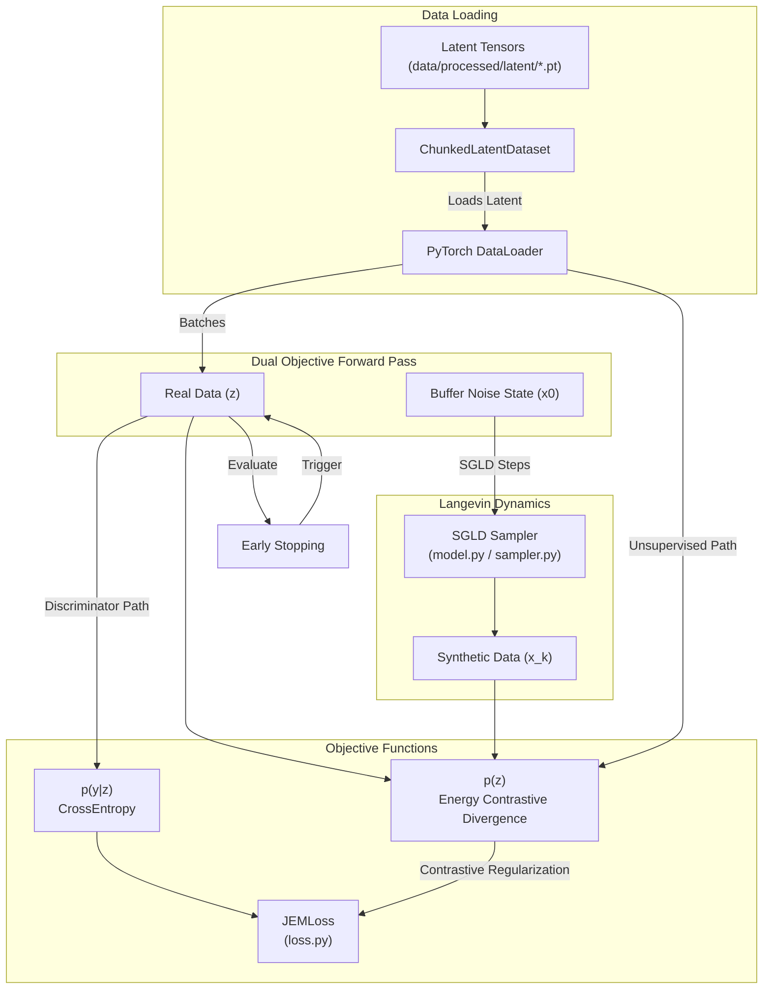
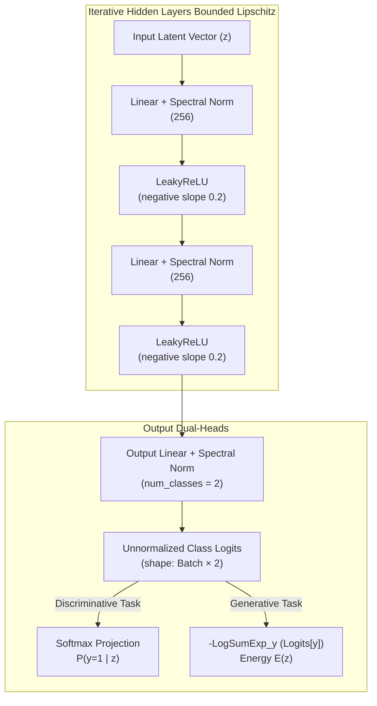

# Joint Energy Model (JEM) Training

## Overview
The Joint Energy Model pipeline (`src/model/jem/train_latent.py`) takes the extracted, normalized latent tensors (`z`) produced by the Autoencoder and learns an energy distribution using a hybrid Discriminative & Generative training strategy. It employs Stochastic Gradient Langevin Dynamics (SGLD) with a temporal replay buffer for efficient sampling.

## Core Modules References
* `src/model/jem/train_latent.py`: The main orchestrator for training on `.pt` latent chunks. Modulates the iteration over chunks and epochs.
* `src/model/jem/model.py`: Implements the core `JEM` energy neural network.
* `src/model/jem/loss.py`: Defines the dual objective (`JEMLoss`) separating the Discriminative (CrossEntropy) and Generative (Energy MCMC) components.
* `src/model/jem/sampler.py`: Maintains the `SGLDReplayBuffer` responsible for initiating Langevin sampling directly from historical model synthesis steps to guarantee diverse sample coverage without exploding compute.
* `src/model/jem/diagnostics.py`: Evaluates distributional tracking metrics like Out-Of-Distribution (OOD) distance dynamically.
* `src/model/jem/data_utils.py`: Provides the `ChunkedLatentDataset` to progressively feed `.pt` matrices to PyTorch.

## Network Training Architecture

JEM operates in two distinct phases: determining class probabilities mapping latent state $\rightarrow$ classification `y` (`p(y|x)`), and constructing an unsupervised density function mapping state $\rightarrow$ pure energy `score` (`p(x)`).

## Neural Network Architecture (`TabularJEM`)

The **TabularJEM** architecture is purposefully designed to maintain absolute numerical stability. To guarantee deterministic $E(x)$ measurements without cross-sample contamination, the network systematically avoids `BatchNorm` and acts as a strict `LeakyReLU`-activated Multi-Layer Perceptron.

## Langevin Dynamics & SGLD
Instead of randomizing completely unstructured noise every step, JEM uses an `SGLDReplayBuffer`. The buffer stores high-probability configurations generated historically by the model. When a new optimization step asks for an "energy minimum state":
1. The replay buffer selects $N$ elements (`P%` sampled from the historical cache, `1-P%` drawn from entirely Uniform Noise).
2. The sampled items perform `n_steps` optimizations in the negative gradient direction of the neural network's energy space ($E_\theta(x)$).
3. Contrastive divergence computes the distance between Real Sample energies ($z$) against Synthetic Sample energies ($x_k$).
4. The synthesized values are then deposited back into the replay buffer to be chained onto in future iterations.

## Early Stopping & Model Persistence
To ensure optimal downstream performance, JEM training monitors the **Validation Stability (Gini)** metric.
- **Monitored Metric:** `stability` (Validation Gini).
- **Mode:** `max` (stops when Gini stops increasing).
- **Patience:** 5 epochs.
- **Weight Restoration:** The model automatically restores weights from the epoch with the highest Gini score before final packaging.

Because of the heavy optimization cost, training generates model checkpoints frequently. Upon reaching maximum epochs or convergence triggers, it exports the `jem_model.pt` weights directly into the active artifact repository where it can be consumed dynamically by the Inference engine.

---

## Appendix: Specialized Neural Network Components

As you dive into the architecture, here is a breakdown of the specific logic applied to the neural layers in the JEM architecture:

### 1. Spectral Normalization (`spectral_norm`)
* **What it is:** A mathematical weight normalization technique that divides the weights of a linear layer by its largest singular value (the spectral norm).
* **What it does:** It forcefully bounds the Lipschitz constant of the network so it is always $\leq 1$. In mathematical terms, this places a strict speed limit on the slopes of the network. It means the output energy $E(x)$ cannot suddenly spike or plummet infinitely fast between two nearby data points.
* **Goal & Scope:** Crucially, Energy-Based Models (EBMs) compute the gradients of the input *with respect to* the output energy to execute Langevin Dynamics (SGLD). If the energy cliffs are too steep, the SGLD sampler gradients mathematically explode to infinity and immediately crash the training. Spectral Normalization prevents this by artificially smoothing the dimensional space so the sampler safely "rolls" downhill into high-probability valleys.

### Why BatchNorm is Missing
You will notice the explicit **absence** of `BatchNorm1d` or `LayerNorm` across the JEM architecture (despite their heavy use in the Autoencoder).
* **Goal & Scope:** Energy measurements *must* be strictly deterministic and independent. If we used `BatchNorm1d` here, the computed Energy $E(x)$ of *Profile A* would subtly depend on the mean of the other profiles coincidentally inside that exact batch. This breaks the fundamental laws of energy-based math.
* By structuring the `TabularJEM` as a strict sequence of independent `Linear` layers and `LeakyReLU` activations (smoothed by `spectral_norm`), we guarantee the energy of a sample remains completely isolated and mathematically pure.
