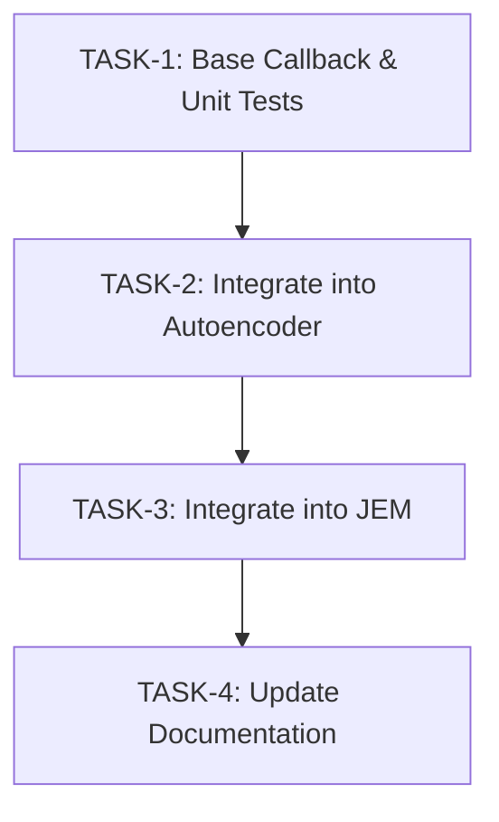

# Plan: Early Stopping Implementation

## Overview
This plan outlines the atomic, deterministic steps to implement the Early Stopping Mechanism described in `spec.md` and `architecture.md`.

Because this feature adds a completely new utility class and modifies two separate core execution pipelines, we will follow a slightly complex, phased approach separated by testing guarantees.

## Execution Dependencies

## Task Definitions

### [TASK-1] Implement Base `EarlyStopping` Utility
**Objective:** Create the core, framework-agnostic (using PyTorch objects) early stopping callback that tracks metrics and controls state safely.
- **File to Edit/Create:** `src/utils/callbacks.py`
- **Actions:**
  1. Define `EarlyStopping` class accepting `patience`, `min_delta`, and `mode` ("min" or "max").
  2. Implement `__call__(metric, model)` to evaluate new bests, copy deep weights (`copy.deepcopy(model.state_dict())` or similar memory caching), and increment the patience counter.
  3. Implement `restore_best_weights(model)` to apply the highest performing state dict to the model safely.
- **Definition of Done (DoD):** Ensure a comprehensive unit test within `tests/utils/test_callbacks.py` (or similar) executes, validating both "min" (Loss) and "max" (Gini) modes. The test should mock a model, trigger stopping conditions correctly based on patience, and prove that `restore_best_weights` reverts the mock state.

### [TASK-2] Integrate Early Stopping to Autoencoder
**Objective:** Hook the utility into the training loop for the un-supervised Autoencoder phase.
- **File to Edit:** `src/model/autoencoder/train_autoencoder.py`
- **Actions:**
  1. Initialize `EarlyStopping(patience=5, mode="min")` before the main epoch loop.
  2. Inside the loop, measure `avg_loss` at the end of every epoch (the aggregation of chunked losses). Note: Use pure `train_loss` for now, unless an explicit validation hold-out logic is added in the file.
  3. Call `early_stopping(avg_loss, model)`. If `True`, break the epoch loop.
  4. At the very end of the training function (outside the loop), automatically perform `early_stopping.restore_best_weights(model)` before saving the model payload.
- **Definition of Done (DoD):** Execute (or mock) a short test run demonstrating loop interruption and confirming the console correctly outputs "Early Stopping Triggered" logs.

### [TASK-3] Integrate Early Stopping to JEM Training (`train_latent.py`)
**Objective:** Hook the utility into the Latent JEM classification loop. This requires accurately recording the binary classification Gini to use as metric.
- **File to Edit:** `src/model/jem/train_latent.py`
- **Actions:**
  1. Initialize `EarlyStopping(patience=5, mode="max")` specifically focusing on Gini improvement.
  2. In the epoch end evaluation phase, calculate the aggregate Gini score. If no specific validation logic exists, aggregate the train Gini natively. (If modifying the file to handle a validation chunk, evaluate it here).
  3. Call `early_stopping(gini_score, model)` to track improvements. Break if it flags.
  4. Reapply `restore_best_weights(model)` at completion prior to persistence.
- **Definition of Done (DoD):** Execute a small batch verification (or test script running `main()`) confirming patience accumulation stops JEM iteration when the Gini stabilizes.

### [TASK-4] Update Documentation
**Objective:** Ensure that all architectural, pipeline, and code-level documentation is accurately updated to reflect the new Early Stopping mechanism.
- **Files to Verify/Edit:** `docs/pipeline/02_autoencoder_training.md`, `docs/pipeline/03_jem_training.md`, and any relevant inline docstrings.
- **Definition of Done (DoD):** Relevant documentation in the `docs` directory correctly explains how early stopping works, the configuration parameters available, and how the best weights are restored during chunked training.
